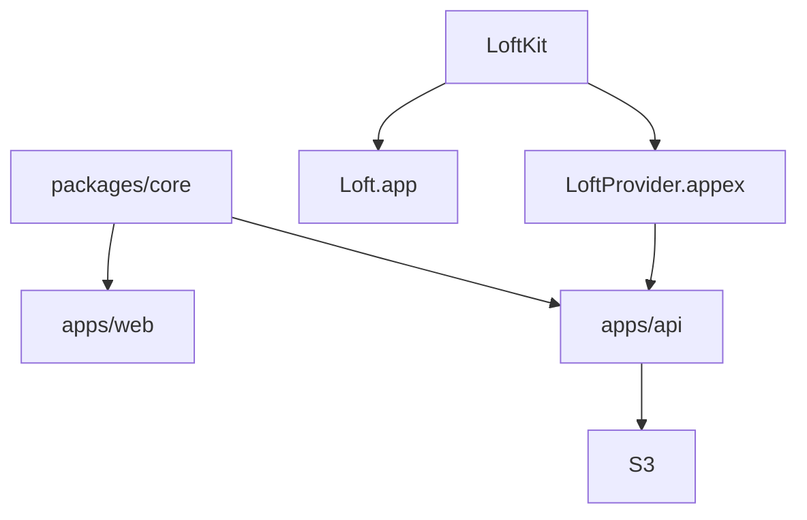

# Architecture

Loft is a Bun workspace with a Swift package beside it. Bytes live in S3 or a
local disk. Finder talks to a File Provider that range-reads the storage API.

- `@loft/core` — catalog, placeholder disk math, share/request URLs, menu copy.
- `apps/web` — marketing site, `/r/:token` uploads, `/s/:id` signed player.
- `apps/api` — storage API (disk or S3), Range GET, keep, signed share, 30-day trash.
- `infra/aws` — Terraform for the bucket, CloudFront, ECR, and ECS API.
- `apps/macos` — menu-bar app, File Provider extension, local volume fallback.

File-size budget is 400 lines; 20 files per directory unless listed in
`scripts/flat-directory-budgets.json`.
