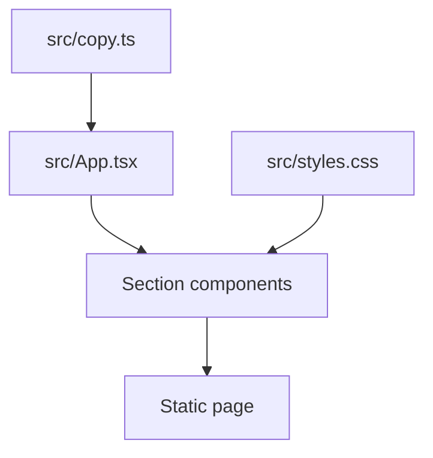

# Architecture

The site is a Vite + React app. Copy lives in `src/copy.ts`. Layout tokens in
`src/styles.css` match the public marketing density: 880px content, 16px
radius, `#f5f5f5` page ground, SF/Inter stack.

There is no application backend here. Download points at GitHub Releases.
Pricing math is local (`src/lib/price.ts`) so the stepper cannot drift from
the published $9/TB rate.

## Constraints

- One route. No app shell, auth, or CMS.
- File-size budget 400 lines; 20 files per directory unless listed in
  `scripts/flat-directory-budgets.json`.
- Bun for install, tests, and hygiene scripts.
