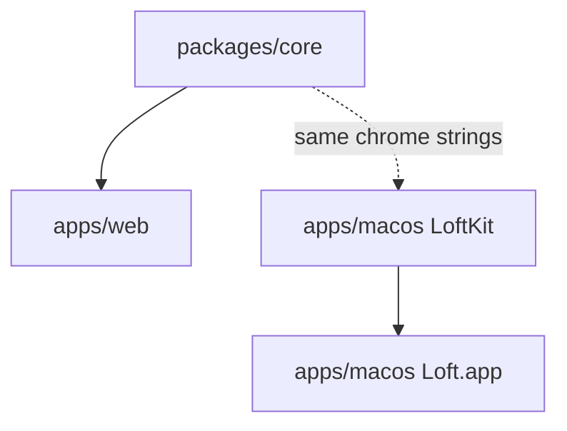

# Architecture

Loft is a Bun workspace with a Swift package beside it.

- `@loft/core` — catalog, placeholder disk math, share/request URLs, status-menu copy.
- `apps/web` — marketing site and the request-files landing page (`/r/:token`).
- `apps/macos` — menu-bar app, search, drop overlay, settings, local drive store.

File-size budget is 400 lines; 20 files per directory unless listed in
`scripts/flat-directory-budgets.json`.
