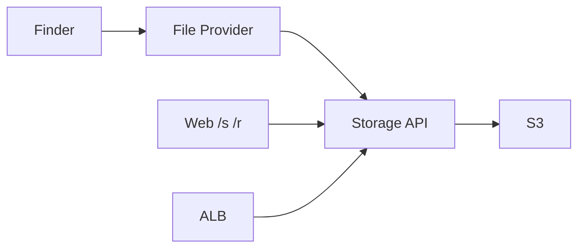

# Cloud

Loft is a free, self-hosted drive. Object bytes live in S3 (or a local disk
for development). The Mac File Provider asks the storage API for **aligned
byte ranges**. Share links are HMAC-signed. Deletes stay in trash for 30 days.



## Storage API

`apps/api` is a Bun server:

| Method | Path | Auth | Role |
| --- | --- | --- | --- |
| GET | `/health` | no | liveness |
| GET | `/v1/me` | bearer | account email and usage |
| GET | `/v1/files` | bearer | list (`?trash=1` for trash) |
| GET | `/v1/files/:id/content` | bearer | body, honors `Range` |
| PUT | `/v1/files/:id/content` | bearer | upload |
| POST | `/v1/files/:id/keep` | bearer | keep on this Mac |
| GET | `/v1/files/:id/share` | bearer | issue tracked `/s/:link?exp&sig` |
| DELETE | `/v1/files/:id` | bearer | trash (30 days) |
| POST | `/v1/files/:id/restore` | bearer | restore |
| GET | `/v1/sharing` | bearer | active issued share links and file requests |
| DELETE | `/v1/sharing/:link` | bearer | revoke a link or close a request |
| POST | `/v1/requests` | bearer | issue an upload request with JSON `folder` |
| GET | `/s/:link` | sig query | share bytes for an active issued link |
| GET | `/s/:link/meta` | sig query | file metadata; records a page open |
| GET | `/r/:token` | request token | request destination and expiry |
| PUT | `/r/:token` | request token | upload into the saved destination |
| POST | `/v1/trash/purge` | bearer | drop trash older than 30 days |

```bash
bun --filter @loft/api dev
```

PUT content honors `If-Match` (etag) and `Content-Range` for resume. Optional
`LOFT_BPS` caps download speed. Extra bearers go in `LOFT_TOKENS`. Pass
`kms_key_arn` to Terraform for SSE-KMS instead of AES256.

## Sharing and file requests

Set `LOFT_WEB` to the public web origin for issued links. Share and request
records live alongside file metadata under `links/` in the disk root or S3
bucket. Links expire after seven days. Revoking a link stops subsequent
access without deleting the underlying file. Closing a request stops new
uploads without removing files already received. In-flight transfers may
finish after revocation.

The Shared page lists issued records, with separate share-link and file-request
views. Opens count successful metadata requests, including repeat visits;
uploads count successful uploads. Counts are not unique visitor analytics.
Metadata updates are serialized within one API process; run one API writer
per store. Multiple writers require a transactional store or conditional writes.

Previously generated untracked `/s/:file` and arbitrary `/r/:token` URLs are
no longer accepted. Recreate share links with Copy Link and file requests
with Request Files or the web app. Public request uploads always use the
saved destination; upload headers cannot redirect them to another folder.

## AWS

`infra/aws` is Terraform: a private bucket, CloudFront for ranged GET, an IAM
task role, ECR, and an optional ECS Fargate service behind an ALB. Desired
count starts at 0 until you push an image:

```bash
cd infra/aws
terraform init
terraform apply
docker build -f apps/api/Dockerfile -t "$(terraform output -raw ecr_repository):latest" ../..
terraform apply -var api_desired_count=1
```

Set `loft_token` in Terraform; it does not mint access keys. Point the Mac app
at `LOFT_API` = the ALB URL.

Helumi’s own stack is Cloudflare. Loft’s equivalent is S3 plus this API. The
Mac still needs a **signed** File Provider appex before Finder shows the
domain next to Macintosh HD; unsigned local builds keep the Loft volume
fallback.
