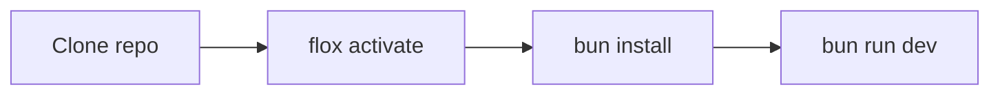

# Getting started

You need [Flox](https://flox.dev) or a local [Bun](https://bun.sh/) 1.4 install.

```bash
flox activate
bun install --frozen-lockfile
bun run dev
```

Open `http://localhost:3000`. Request-files landings use `/r/<token>` and PUT
into the storage API. Signed shares use `/s/<id>?exp=&sig=`.

Storage API (disk backend, no AWS required):

```bash
bun --filter @loft/api dev
```

Set `VITE_API=http://127.0.0.1:8787` when the web app is not on the same host.

Or run only the API in Docker:

```bash
docker compose up --build
```

On macOS:

```bash
bun run macos:test
scripts/package-macos.sh
open dist/Loft.app
```



`bun run ci` is the full local gate. Git hooks call the same scripts.
