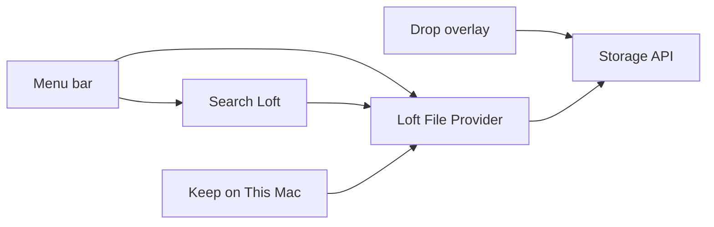

# macOS app

Loft lives in the menu bar and exposes a File Provider drive in Finder
Locations. Files download when opened. **Keep on This Mac** pins files on
this device and asks Finder to materialize them for offline access.



- **Search Loft** (Control-Option-O) lists real remote files and reports
  connection failures. Opening a result uses its File Provider URL.
- **Open in Finder** opens the registered domain. If unavailable, Loft
  explains that the signed File Provider must be enabled.
- **Drop** lets you choose an existing folder or Inbox before uploading.
  Failed files remain available for retry; successful files are not retried.
- **Keep on This Mac** stores a device-local pin. The transfer panel waits
  for Finder materialization and reports bytes verified by a coordinated
  read. Closing the panel stops waiting; Finder manages the pinned download.
- **Settings** displays measured disk capacity, actual cloud usage, and
  File Provider availability. Unavailable data is reported explicitly.
- **Copy Loft Link** and **Request Files…** use the persisted sharing API.

The File Provider extension (`LoftProvider`) is embedded at
`Contents/PlugIns/LoftProvider.appex`. Full downloads read all bytes in bounded
chunks, guard the remote version, and replace local files only after success.
Range downloads preserve alignment and requested coverage. Authentication,
conflict, network, and write errors propagate to Finder rather than reporting
success. Folder creation and metadata-only moves/renames are not implemented.

The packaging script uses an ad-hoc signature for local builds. Activating
and testing the Finder domain requires a correctly signed and entitled
installation; a successful Swift build does not verify that integration.
Normal launches do not mount a demo disk image. The `--preview` flag retains
the sparse demo volume for development only.

```bash
bun --filter @loft/api dev
bun run macos:test
bun run macos:build
scripts/package-macos.sh
```
