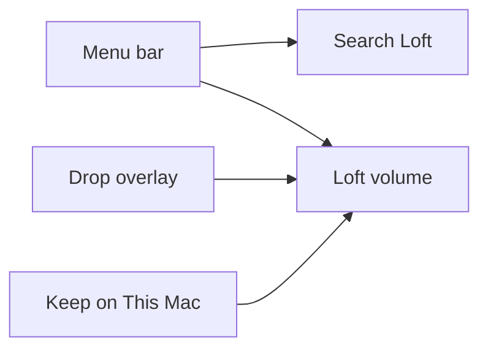

# macOS app

Loft lives in the menu bar and mounts a **Loft** volume in Finder Locations.
Files list at full size and stay **sparse** (about zero bytes on disk) until
you choose **Keep on This Mac**.



Product chrome from the public Helumi app:

| Surface | Behavior |
| --- | --- |
| Status menu | Search Loft ⌃⌥O, Open in Finder, Your Account↗, Send Feedback, Settings…, Quit Loft |
| Global search | Control-Option-O |
| Drop | Release to add onto the menu-bar mark |
| Finder | `/Volumes/Loft` when the disk image attaches; otherwise the support folder |
| Keep | Transfer HUD, then a kept xattr so size-on-disk is no longer empty |
| Share / request | Copy Loft Link; Request Files… opens `/r/:token` |

A signed File Provider appex (`LoftProvider`) range-reads `apps/api` with
alignment, folders, delete-to-trash, keep as a full GET onto disk, and a
Finder **Keep on This Mac** action. Package embeds it at
`Contents/PlugIns/LoftProvider.appex`. Until Apple signs the domain, Open in
Finder still uses `/Volumes/Loft` or the support folder. Drop and search talk
to the storage API when it is reachable.

```bash
bun --filter @loft/api dev
bun run macos:test
bun run macos:build
scripts/package-macos.sh
```
