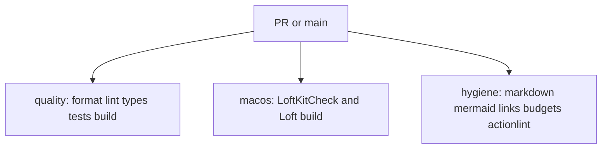

# CI

`ci.yml` runs on pull requests and on `main`. The Ubuntu jobs enter Flox so the
runner uses the locked toolchain. The macOS job uses Xcode Swift.

| Job | Runner | Checks |
| --- | --- | --- |
| quality | GitHub-hosted Ubuntu 24.04 | `bun run` format, lint, typecheck, test, build |
| macos | GitHub-hosted macOS 15 | `swift run LoftKitCheck` and `swift build` for Loft.app |
| hygiene | GitHub-hosted Ubuntu 24.04 | docs, LOC budgets, actionlint, `git diff --check` |

A green `ci` run on `main` is what [auto-release](releasing.md) waits for.
