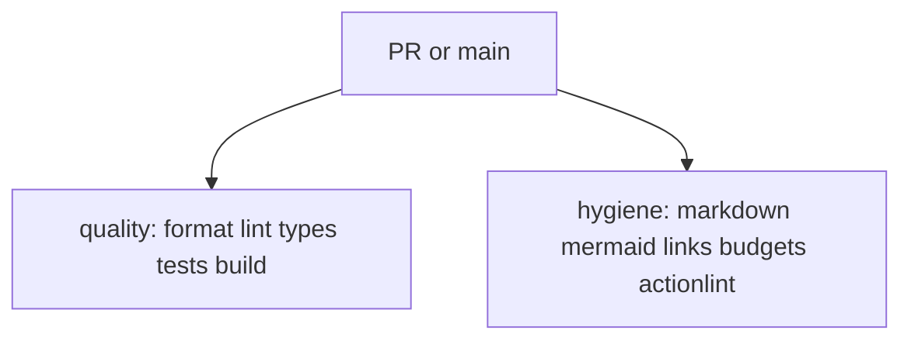

# CI

`ci.yml` runs on pull requests and on `main`. Both jobs enter Flox so the
runner uses the locked toolchain.

| Job | Runner | Checks |
| --- | --- | --- |
| quality | Blacksmith Ubuntu 4 vCPU | `bun run` format, lint, typecheck, test, build |
| hygiene | Blacksmith Ubuntu 2 vCPU | docs, LOC budgets, actionlint, `git diff --check` |

A green `ci` run on `main` is what [auto-release](releasing.md) waits for.
