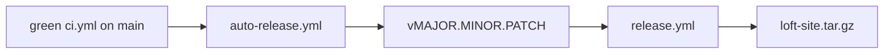

# Releasing

Hab-style auto-release: a green `ci.yml` on `main` cuts the next patch tag and
dispatches `release.yml`.

1. Skip if `HEAD` already has a `v*.*.*` tag.
2. Else increment the latest patch, or start at `v0.1.0`.
3. `release.yml` checks that the tag is on `origin/main`, runs `bun run ci`,
   and publishes the built site tarball and `loft-macos.zip` on the GitHub Release.

Manual: `gh workflow run release.yml -f tag=v0.1.0` after the tag exists.
