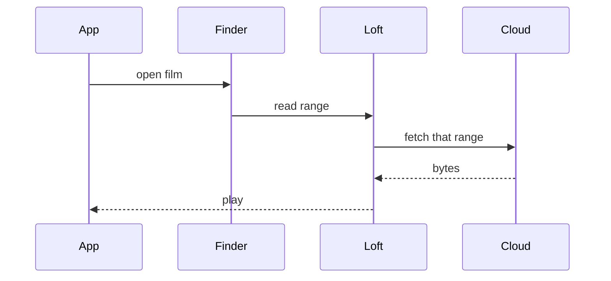

# Product

Loft is a Finder drive. Files look local, live in the cloud, and open by
streaming only the bytes the app needs.

## Why it exists

Cloud folders still copy whole files onto the Mac before they open. A 50 GB
film then sits on disk. Loft keeps that payload off the SSD until you play,
scrub, or export it.

## How a file opens

## Plan

Loft is free. You run the storage API and, if you want object storage in AWS,
the Terraform in `infra/aws`. There is no billing gate.

macOS 26 Tahoe or newer is what Helumi requires for its File Provider drive.
Loft’s extension targets the same Finder domain; unsigned local builds still
mount a Loft volume so the rest of the app runs.
