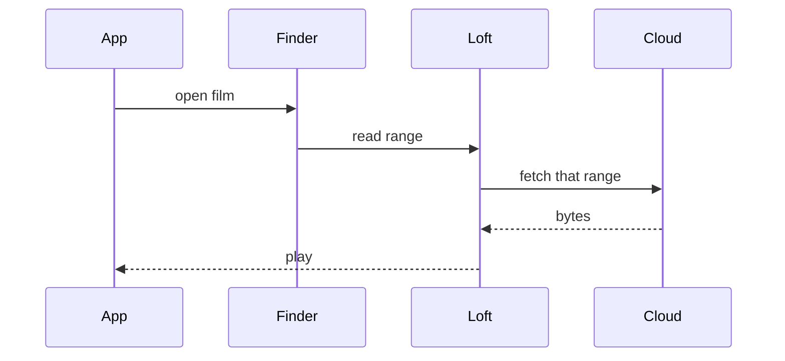

# Product

Loft is a Finder drive. Files look local, live in the cloud, and open by
streaming only the bytes the app needs.

## Why it exists

Cloud folders still copy whole files onto the Mac before they open. A 50 GB
film then sits on disk. Loft keeps that payload off the SSD until you play,
scrub, or export it.

## How a file opens

## Plan

Storage is $9 per TB per month, from 1 TB to 30 TB. Cancel any time. Files are
not deleted if billing stops; you cannot add new ones until a plan is active
again.

macOS 26 Tahoe or newer is required, because loft uses Apple's current drive
stack.
